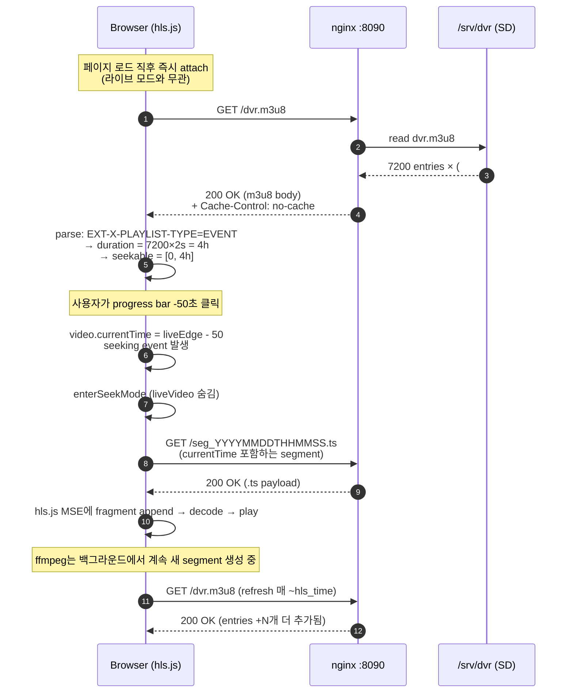
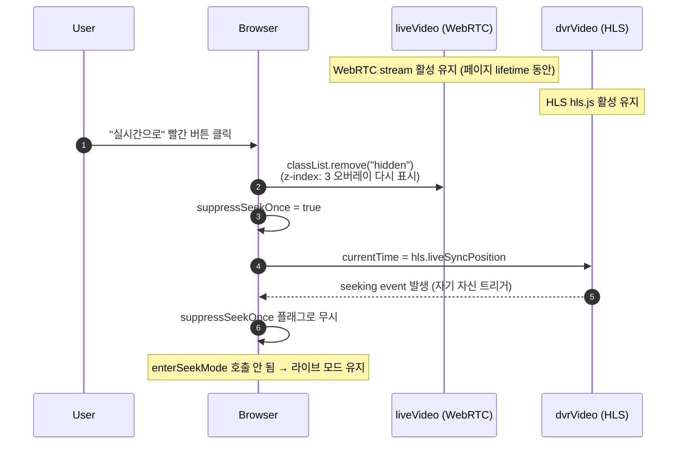
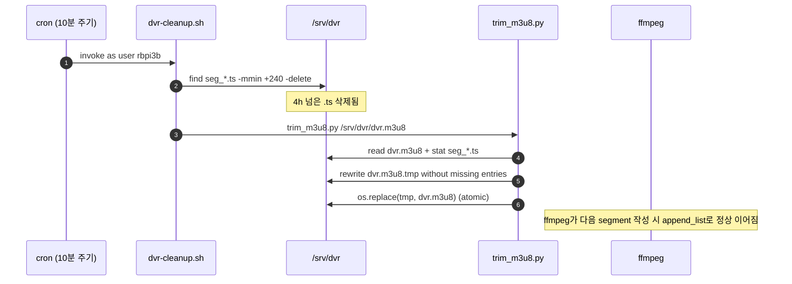
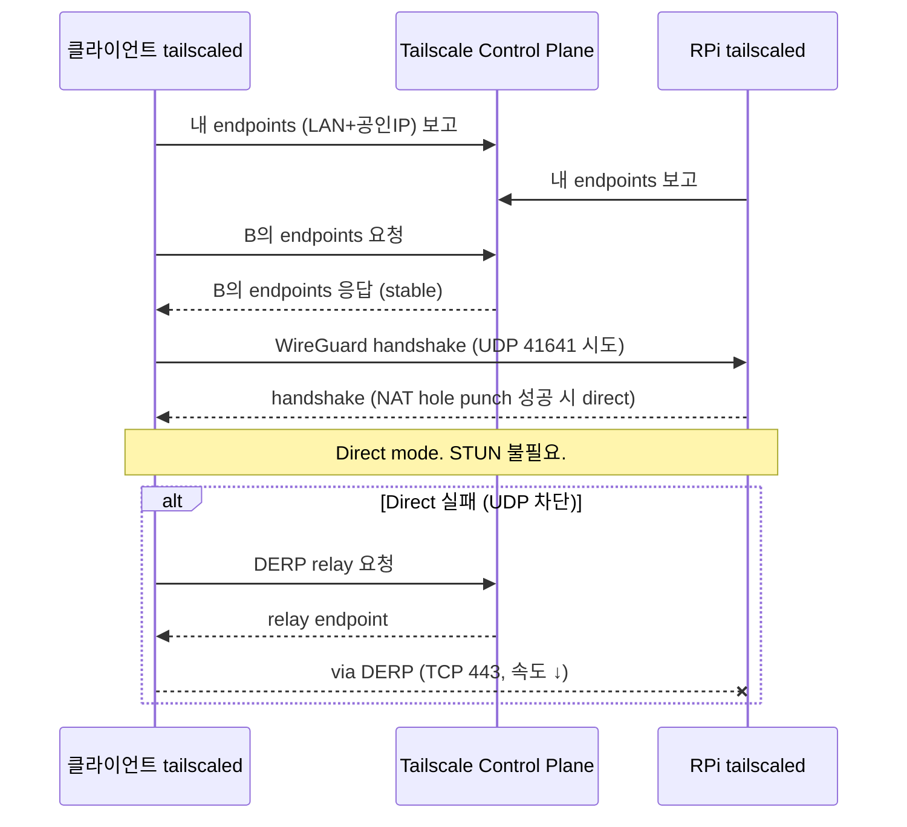

# rpi-camera-dvr

라즈베리파이 IP카메라(IMX219 / Pi Camera Module)에 **치지직 / 트위치 / 유튜브 라이브 수준의 DVR(타임머신) 재생 + 무지연(WebRTC) 라이브**를 결합한 IP카메라 노드.

휴대폰으로 라이브를 보다가 시크바를 왼쪽으로 끌면 **방송 시작 시점(또는 최근 N시간)** 까지 되돌려 볼 수 있고, "**실시간**" 버튼 한 번이면 라이브로 복귀 — 즉 치지직과 동일한 UX를 라즈베리파이 한 대 + SD카드 저장으로 구현.

라이브는 [WebRTC (RFC 8825)](https://datatracker.ietf.org/doc/html/rfc8825) 패킷 기반으로 ~0.2초, 시크백은 [HTTP Live Streaming (RFC 8216)](https://datatracker.ietf.org/doc/html/rfc8216) 위에 [`EXT-X-PLAYLIST-TYPE:EVENT`](https://datatracker.ietf.org/doc/html/rfc8216#section-4.3.3.5) timeline으로 4시간 누적.

---

## Table of Contents

1. [System architecture](#1-system-architecture)
2. [Tech stack](#2-tech-stack)
3. [Engineering decisions (8 ADRs)](#3-engineering-decisions-8-adrs)
4. [Performance & resource budget](#4-performance--resource-budget)
5. [Repository layout](#5-repository-layout)
6. [Quick install](#6-quick-install)
7. [Usage](#7-usage)
8. [Operations](#8-operations)
9. [Protocol exchange diagrams](#9-protocol-exchange-diagrams)
10. [Configuration deep-dive](#10-configuration-deep-dive)
11. [Code walkthrough](#11-code-walkthrough)
12. [Security & threat model](#12-security--threat-model)
13. [Networking deep-dive](#13-networking-deep-dive)
14. [Migration guides](#14-migration-guides)
15. [API reference](#15-api-reference)
16. [Documentation map](#16-documentation-map)
17. [Roadmap & status](#17-roadmap--status)
18. [Risk register](#18-risk-register)
19. [Related projects & OSS NVR comparison](#19-related-projects--oss-nvr-comparison)
20. [Glossary](#20-glossary)
21. [Changelog](#21-changelog)
22. [License & contributing](#22-license--contributing)

---

## 1. System architecture

```
[IMX219 카메라]
       │ MIPI CSI-2 (Sony 8MP, 1280x720@15)
       ▼
[Raspberry Pi 3B (Debian 13 Trixie aarch64)]
  │
  ├── rpicam-vid                                   ─── HW 인코더 (bcm2835-codec, v4l2m2m)
  │     --codec h264 --profile baseline --inline   ─── 매 keyframe SPS/PPS 인라인 (HLS 호환)
  │     --intra 30 --bitrate 1000000               ─── 2초 GOP @ 15fps, 1Mbps CBR
  │       │ stdout = annex-B H.264 elementary stream
  │       ▼ pipe
  ├── ffmpeg (-c:v copy, 재인코딩 0)
  │     ├──► HLS muxer
  │     │     -hls_time 2 -hls_list_size 0
  │     │     -hls_playlist_type event             ─── m3u8 전체를 seekable timeline으로 광고
  │     │     -hls_flags independent_segments
  │     │       +program_date_time+append_list     ─── 매 segment 절대시각 + restart 시 이어쓰기
  │     │     -strftime 1
  │     │     -hls_segment_filename
  │     │       seg_%Y%m%dT%H%M%S.ts               ─── 파일명에 wall-clock (restart 충돌 회피)
  │     │     /srv/dvr/dvr.m3u8 + seg_*.ts
  │     │
  │     └──► RTSP push (-f rtsp -rtsp_transport tcp)
  │           rtsp://localhost:8554/cam            ─── localhost only, MediaMTX로
  │
  ├── MediaMTX v1.18.1 (single binary daemon)
  │     :8554/TCP   RTSP ingest                    ─── ffmpeg가 publish
  │     :8889/TCP   WebRTC HTTP (WHEP)             ─── POST /cam/whep -> SDP answer
  │     :8189/UDP   ICE/SRTP                       ─── 미디어 전송
  │     webrtcAdditionalHosts: [<tailscale-ip>]    ─── ICE candidate 광고
  │
  ├── nginx :8090
  │     /dvr.m3u8, /seg_*.ts                       ─── 정적 파일 서빙 (Cache-Control: no-cache)
  │     /player/                                   ─── 단일 페이지 SPA (hls.js + Plyr + RTCPeerConnection)
  │
  └── cron (10분 주기) → /usr/local/bin/dvr-cleanup.sh
        find -mmin +240 -delete                    ─── 4h 보존
        trim_m3u8.py                               ─── 디스크와 m3u8 동기화
       │
       │ Tailscale 0.x.x.x (NAT 통과 P2P, mesh VPN)
       │ STUN/TURN 불필요 (Tailscale가 ICE 대체)
       ▼
[브라우저 (PC/모바일)]
  player/index.html
    ┌─ liveVideo  (WebRTC, RTCPeerConnection.ontrack → srcObject)
    │   ─ z-index: 3, pointer-events: none (오버레이)
    │   ─ controls 없음, dvrVideo의 컨트롤이 시계가 됨
    │
    └─ dvrVideo   (HLS, hls.js MSE → src)
        ─ controls 있음 (Plyr UI: progress, fullscreen 등)
        ─ 페이지 lifetime 동안 attach 영구 유지
        ─ 라이브 모드일 때도 백그라운드에서 라이브 끝쪽 추종

  토글 휴리스틱:
    - seeking event → 라이브 위치 ±3초 밖이면 enterSeekMode
      (liveVideo 숨김, dvrVideo가 그 위치로)
    - pause event → enterSeekMode (정지 화면)
    - "실시간으로" button → enterLiveMode
      (liveVideo 표시, dvrVideo.currentTime = liveSyncPosition)
    - suppressSeekOnce flag로 자기 자신이 트리거한 seek 1회 무시
```

자세한 설계 근거 — 컴포넌트별 책임 분담, dual-`<video>` 토글이 필요했던 이유, fan-out 설계 — 는 [`docs/ARCHITECTURE.md`](docs/ARCHITECTURE.md).

---

## 2. Tech stack

### 2.1 하드웨어

| 항목 | 모델 | 비고 |
|---|---|---|
| SBC | Raspberry Pi 3B (BCM2837, Cortex-A53 4코어 1.2GHz, 1GB LPDDR2) | aarch64 64-bit OS 사용 |
| 카메라 | Sony IMX219 8MP (Pi Camera v2 호환) | MIPI CSI-2 4-lane |
| 저장 | microSD 16GB | High-Endurance 권장 (TBW ↑) |
| 네트워크 | 내장 2.4GHz Wi-Fi 또는 100Mbps Ethernet | Tailscale direct P2P |

### 2.2 OS / runtime

| 항목 | 버전 | 용도 |
|---|---|---|
| Raspberry Pi OS Bookworm/Trixie 64-bit | Debian 13 (aarch64) | 베이스 OS |
| systemd | 256+ | 서비스 supervisor |
| systemd-timesyncd 또는 chrony | 활성 | NTP 동기 — `EXT-X-PROGRAM-DATE-TIME` 신뢰성 |
| Python | 3.12 (apt 기본) | `stream_server.py` supervisor + `trim_m3u8.py` |

### 2.3 미디어 파이프라인 (RPi 측)

| 도구 | 버전 | 라이선스 | 역할 |
|---|---|---|---|
| `rpicam-apps` (`rpicam-vid`) | apt 기본 | BSD-2 | libcamera 기반 카메라 캡처 + H.264 HW 인코딩 |
| libcamera | apt 기본 | LGPL-2.1 | 카메라 stack |
| H.264 HW 인코더 | bcm2835-codec (VideoCore IV) | — | profile=Baseline / level=4.0 |
| ffmpeg | 6.x apt | LGPL/GPL | demux + HLS mux + RTSP push (`-c:v copy`만, 재인코딩 0) |
| [MediaMTX](https://github.com/bluenviron/mediamtx) | v1.18.1 (linux_arm64 single binary) | MIT | RTSP ingest + WebRTC(WHEP) publish + RTP packetize |
| nginx | apt 기본 | BSD-2 | 정적 m3u8/.ts/플레이어 페이지 서빙 |

### 2.4 클라이언트 (브라우저)

| 라이브러리 | 버전 | 라이선스 | 용도 |
|---|---|---|---|
| [hls.js](https://github.com/video-dev/hls.js) | 1.x (CDN: jsDelivr) | Apache-2.0 | HLS m3u8/.ts 디코딩 + MSE 재생 |
| [Plyr](https://github.com/sampotts/plyr) | 3.7.8 (CDN) | MIT | 비디오 컨트롤 UI (progress / fullscreen / pip / settings) |
| `RTCPeerConnection` | 브라우저 native | — | WHEP 클라이언트 — POST SDP offer → answer 협상 후 RTP 수신 |
| `MediaSource Extensions` | 브라우저 native | — | hls.js의 video element 부착 backend |

### 2.5 프로토콜 표준

| 프로토콜 | 용도 | 표준 |
|---|---|---|
| HLS | DVR 시크백 | [RFC 8216](https://datatracker.ietf.org/doc/html/rfc8216) |
| HLS EVENT playlist | 시크 가능 timeline | [§4.3.3.5](https://datatracker.ietf.org/doc/html/rfc8216#section-4.3.3.5) |
| WebRTC | 라이브 0.2초 | [RFC 8825](https://datatracker.ietf.org/doc/html/rfc8825) overview |
| SRTP/RTP | WebRTC 미디어 | [RFC 3711](https://datatracker.ietf.org/doc/html/rfc3711), [RFC 3550](https://datatracker.ietf.org/doc/html/rfc3550) |
| WHEP | WebRTC HTTP egress (player 협상) | [IETF draft `whep`](https://datatracker.ietf.org/doc/draft-murillo-whep/) |
| RTSP | 내부 ffmpeg → MediaMTX publish | [RFC 7826](https://datatracker.ietf.org/doc/html/rfc7826) (RTSP 2.0) |
| ICE / STUN | WebRTC NAT 통과 | [RFC 8445](https://datatracker.ietf.org/doc/html/rfc8445) (Tailscale 환경에선 거의 불필요) |
| Annex-B / SPS/PPS | H.264 elementary stream framing | ITU-T H.264 |

### 2.6 포트 맵

| 포트 | 프로토콜 | 노출 | 용도 |
|---|---|---|---|
| 8090/TCP | HTTP (nginx) | LAN/Tailscale | 정적 m3u8/.ts/player |
| 8889/TCP | HTTP (MediaMTX) | LAN/Tailscale | WebRTC WHEP 시그널링 (`POST /cam/whep`) |
| 8189/UDP | SRTP/ICE (MediaMTX) | LAN/Tailscale | WebRTC 미디어 전송 |
| 8554/TCP | RTSP (MediaMTX) | **localhost only** | ffmpeg push 수신 |
| ~~8080/TCP~~ | ~~MJPEG~~ | — | **본 빌드에서 제거** ([ADR #8](#3-engineering-decisions-8-adrs)) |

---

## 3. Engineering decisions (8 ADRs)

이 시스템이 왜 지금의 모습이 됐는가. 각 결정에는 대안과 채택 사유, 그리고 (해당하면) 측정 데이터.

### ADR #1 — H.264 profile = Baseline

| | |
|---|---|
| **Context** | rpicam-vid HW 인코더는 Baseline / Main / High 셋 모두 지원. WebRTC 클라이언트는 [W3C Media Capabilities](https://w3c.github.io/media-capabilities/)에서 profile별 디코더 가용성 다름. |
| **Alternatives** | (a) High (효율 ~10% ↑, 더 나은 압축) (b) Main (B-frame 가능) (c) Baseline (I/P만, B-frame 없음) |
| **Decision** | **Baseline**. |
| **Rationale** | Chrome/Firefox/Safari 모두 Baseline은 native 디코드 OK. High는 일부 브라우저에서 `setRemoteDescription` 시 SDP answer가 비어 오거나 디코드 실패 → WebRTC HLS-fallback. |
| **Consequence** | 같은 화질 대비 비트레이트 +5~10% 필요. 1Mbps 720p15에선 체감 차이 미미. |
| **Verification** | `ffprobe -show_entries stream=profile seg_*.ts` → `Baseline`. 브라우저 콘솔에서 `pc.getStats()`의 `frames-decoded` 증가. |

### ADR #2 — GOP = 30 frames (= 2s @ 15fps)

| | |
|---|---|
| **Context** | HLS segment 시작은 키프레임이어야 시크 정확 ([RFC 8216 §3.4](https://datatracker.ietf.org/doc/html/rfc8216#section-3.4)). |
| **Decision** | `--intra 30` + `-hls_time 2` 정확히 일치. |
| **Rationale** | 시크 단위 = 2초. fragment-aligned. |
| **Consequence** | 비트레이트 효율 약간 ↓ (key frame 더 자주). |

### ADR #3 — H.264 inline SPS/PPS (rpicam-vid `--inline`)

| | |
|---|---|
| **Context** | `h264_v4l2m2m`은 SPS/PPS를 첫 packet에만 출력. ffmpeg HLS muxer는 매 segment에 inject 안 함. |
| **Alternatives** | (a) ffmpeg `-bsf:v dump_extra=freq=keyframe` (b) HLS fmp4 (init.mp4 + .m4s) (c) rpicam-vid `--inline` |
| **Decision** | **(c) `--inline`**. |
| **Rationale** | (a)는 v4l2m2m이 ffmpeg에 extradata 보고 안 해서 BSF가 dump할 게 없음 (실제 시도 → 실패). (b)는 hls.js 호환은 OK이지만 cleanup 스크립트 + cron 재작성 필요. (c)는 rpicam-vid가 매 keyframe에 NAL을 자동 inject — 한 줄 변경. |
| **Verification** | `ffprobe -v error seg_*.ts` 출력에 `non-existing PPS 0` 0건. (자세히는 [`docs/POST-MORTEM.md` §2](docs/POST-MORTEM.md#2-hls-세그먼트가-spspps-누락--검정-화면).) |

### ADR #4 — HLS playlist type = EVENT

| | |
|---|---|
| **Context** | hls.js는 m3u8 첫 fetch 시 `EXT-X-PLAYLIST-TYPE` / `EXT-X-ENDLIST` / 마지막 segment age 등으로 live/event/vod 분류. 분류가 잘못되면 backward seek 차단. |
| **Alternatives** | (a) 명시 없음 (default) (b) `VOD` (c) `EVENT` |
| **Decision** | **EVENT** (`-hls_playlist_type event`). |
| **Rationale** | (a)는 sliding-window live로 인식 → 시크 시 `liveSyncPosition`으로 강제 복귀. (b)는 `ENDLIST`가 박혀 라이브성 사라짐. (c)는 처음부터 끝까지 시크 가능 + 새 segment append 가능. |
| **Verification** | `grep PLAYLIST-TYPE /srv/dvr/dvr.m3u8` → `#EXT-X-PLAYLIST-TYPE:EVENT`. |

### ADR #5 — Frame rate / bitrate = 15fps / 1Mbps @ 720p

| | |
|---|---|
| **Context** | RPi 3B 4코어 Cortex-A53 1.2GHz는 720p30 SW 디코드/인코드를 풀로 돌리면 LOAD 6+. |
| **Alternatives** | (a) 720p30 1.5Mbps (b) 720p15 1Mbps (c) 1080p — 메모리 부족 |
| **Decision** | **(b) 720p15 1Mbps**. |
| **Rationale** | LOAD ~1.8 (4코어, 안정 영역). DVR 4시간 = 1.8GB. 카메라 모니터링 용도엔 15fps 충분. |
| **Verification** | `uptime` 1m 평균 < 4.0 (정원), 측정값 ~1.8. |

### ADR #6 — DVR 보존 = 4시간 (cron 외부 정리)

| | |
|---|---|
| **Context** | `-hls_list_size 0`은 sliding 안 함 → 무한 누적. 보존 정책이 별도 필요. |
| **Alternatives** | (a) ffmpeg `-hls_flags delete_segments` (b) cron + `find -mmin +N -delete` + m3u8 trim |
| **Decision** | **(b)**. |
| **Rationale** | (a)는 ffmpeg가 직접 지우면 m3u8에서도 즉시 빠져 시크 가능 윈도우가 줄어듦. (b)는 segment 파일 보존과 m3u8 등재를 분리 가능. cron 10분 주기 + `trim_m3u8.py`. |
| **Verification** | `ls /srv/dvr/seg_*.ts | wc -l` ~7200 (= 4h × 30 segments/min). |

### ADR #7 — Authentication = Tailscale only

| | |
|---|---|
| **Context** | RPi가 외부에 공개되면 누구나 영상 시청 가능. |
| **Alternatives** | (a) nginx `auth_basic` (b) JWT/OAuth (c) Tailscale ACL |
| **Decision** | **(c)**. |
| **Rationale** | Tailscale가 이미 mesh VPN — RPi에 도달하려면 ACL 통과 필요. nginx/MediaMTX 자체는 인증 없이 운영 가능 → 코드 단순. |
| **Trade-off** | Tailscale 미가입 단말 접근 불가. 외부 공개가 필요하면 (a)/(b) 추가 가능 (nginx `auth_basic` snippet은 [`docs/TROUBLESHOOTING.md` Q&A](docs/TROUBLESHOOTING.md)). |

### ADR #8 — MJPEG 8080 출력 제거

| | |
|---|---|
| **Context** | 멀티보드 뷰어 호환을 위해 8080에 multipart/x-mixed-replace MJPEG도 같이 송출 시도. 그러나 ffmpeg 입력이 H.264이라 MJPEG 출력 시 SW 디코드 + SW MJPEG 인코드 발생. |
| **Measurement** | LOAD 1m avg = **7.8** (4코어 정원 초과, SSH 응답성 저하 관측). |
| **Alternatives** | (a) MJPEG 출력 다운그레이드 (480x270/8fps) — LOAD ~6 정도 (b) MJPEG 제거 — LOAD 1.8 |
| **Decision** | **(b) 제거**. WebRTC가 라이브 담당. |
| **Trade-off** | 멀티보드 뷰어(`localhost:9090`)의 RPi 3B 패널은 connection refused → 검정. 사용자는 DVR 페이지(`8090/player/`)에서 라이브 + 시크 모두 사용. |

전체 사건 흐름은 [`docs/POST-MORTEM.md`](docs/POST-MORTEM.md).

---

## 4. Performance & resource budget

### 4.1 측정 환경

- 보드: Raspberry Pi 3B, BCM2837, 1GB RAM
- OS: Debian 13 Trixie aarch64, kernel 6.x
- 카메라: IMX219 (Pi Camera v2)
- 저장: 16GB Class 10 SD (TBW ~10TB)
- 네트워크: Wi-Fi 2.4GHz, Tailscale direct
- 측정 시점: 2026-05-02 ~ 2026-05-03, 운영 중 안정 상태

### 4.2 측정값

| 항목 | 측정 | 정원/한계 | 마진 |
|---|---|---|---|
| LOAD (1m avg) | **1.8** | 4.0 (4코어 = 100%) | 55% 여유 |
| LOAD (15m avg) | 1.5 | 4.0 | 62% 여유 |
| RAM | **470 MB** / 906 MB | OOM 직전 ~850 | OK |
| RPi → 클라이언트 대역 | ~2 Mbps (HLS+WebRTC 동시) | 100 Mbps | 충분 |
| HLS segment 생성 | 30 segments/min × ~250KB | — | — |
| 4h DVR 디스크 | **1.8 GB** | 9.7 GB free | 21% 사용 |
| 라이브 지연 (WebRTC) | **~0.2초** | — | — |
| 라이브 지연 (HLS fallback) | ~3초 | 6초(권장) | OK |
| 동시 클라이언트 | 5명 검증, 이론상 10+명 | nginx 정적 ∞ + WebRTC N stream | — |

### 4.3 측정 명령어

```bash
# 1. 시스템 부하
uptime                                          # 1m / 5m / 15m
top -bn1 | grep -E "ffmpeg|rpicam|mediamtx"     # 컴포넌트별 CPU%

# 2. 메모리
free -h
ps -o pid,pcpu,pmem,comm -p $(pgrep -f stream_server.py)

# 3. HLS segment 페이스
watch -n 5 'ls /srv/dvr/seg_*.ts | wc -l'      # 분당 ~30 증가가 정상

# 4. 라이브 지연 (실측)
# 폰 화면에 시계 띄우고 카메라로 그 시계를 비춤. 화면-원본 차이를 슬로모션 캡처

# 5. 클라이언트 대역
# 브라우저 DevTools Network 탭, .ts 평균 ~125 KB/s + WebRTC ~125 KB/s

# 6. WebRTC 실측 stats
# 브라우저 콘솔: pc.getStats().then(s => [...s.values()].forEach(v => v.type==='inbound-rtp' && console.log(v)))
#   - framesDecoded, framesDropped, jitter, packetsLost
```

---

## 5. Repository layout

```
.
├── README.md                    ← 본 문서
├── LICENSE                      ← MIT
├── .gitignore
│
├── src/
│   └── stream_server.py         ← rpicam-vid + ffmpeg supervisor
│                                  (systemd unit ExecStart 대상)
├── config/
│   ├── mediamtx.yml             ← MediaMTX 설정 (RTSP + WebRTC)
│   └── nginx-dvr.conf           ← :8090 nginx site
│
├── systemd/
│   ├── camera-stream.service    ← stream_server.py supervisor
│   └── mediamtx.service         ← MediaMTX 데몬
│
├── scripts/
│   ├── dvr-cleanup.sh           ← 4h 보존 정책 (find -mmin +240 -delete)
│   ├── trim_m3u8.py             ← 디스크와 m3u8 동기화
│   └── dvr-cleanup.cron         ← /etc/cron.d 등록용
│
├── web/
│   ├── player/
│   │   └── index.html           ← dual-<video> 토글 SPA
│   └── thumbs/
│       └── thumbs.vtt           ← Phase 2 placeholder (WebVTT 빈 파일)
│
└── docs/
    ├── ARCHITECTURE.md          ← 데이터 흐름, 컴포넌트별 책임
    ├── STACK.md                 ← 버전 표 + 라이선스
    ├── INSTALL.md               ← as-built 기준 설치 단계
    ├── SETUP-GUIDE.md           ← OS 굽기부터의 14단계 매뉴얼
    ├── CONCEPTS.md              ← HLS / DVR / LL-HLS / WebVTT 개념
    ├── HARDWARE.md              ← 보드/카메라/SD/SSD/케이스 비교
    ├── IMPLEMENTATION-PLAN.md   ← 6단계 로드맵 + ffmpeg 옵션 상세
    ├── TROUBLESHOOTING.md       ← 카탈로그형 가이드 (11 섹션)
    ├── POST-MORTEM.md           ← 본 빌드 6 incidents (post-mortem)
    └── REFERENCES.md            ← RFC/W3C/Apple + OSS NVR + 학술 12편
```

---

## 6. Quick install

전제: Raspberry Pi OS Trixie 64-bit, IMX219 CSI 결선됨, Tailscale 가입됨.

### 6.1 의존성

```bash
sudo apt update
sudo apt install -y ffmpeg nginx rpicam-apps libcamera-tools

# 검증
rpicam-vid --help | head -2                                      # libcamera 인식
ffmpeg -encoders 2>/dev/null | grep -E "h264|mjpeg" | head -3
v4l2-ctl --list-devices | grep -A1 unicam                        # CSI sensor 인식
```

### 6.2 MediaMTX

```bash
cd /tmp
URL="https://github.com/bluenviron/mediamtx/releases/download/v1.18.1/mediamtx_v1.18.1_linux_arm64.tar.gz"
wget -q "$URL" -O mediamtx.tar.gz
tar xzf mediamtx.tar.gz
sudo install -m 755 mediamtx /usr/local/bin/mediamtx
mediamtx --version
```

### 6.3 본 저장소 배포

```bash
git clone https://github.com/squid55/rpi-camera-dvr.git
cd rpi-camera-dvr

DVR_USER=$USER   # 카메라 service를 돌릴 OS 사용자
sudo mkdir -p /srv/dvr/player /srv/dvr/thumbs /etc/mediamtx
sudo chown -R $DVR_USER:$DVR_USER /srv/dvr

sudo install -m 644 config/mediamtx.yml         /etc/mediamtx/
sudo install -m 644 config/nginx-dvr.conf       /etc/nginx/sites-available/dvr
sudo ln -sf /etc/nginx/sites-available/dvr      /etc/nginx/sites-enabled/dvr
sudo rm -f /etc/nginx/sites-enabled/default
sudo install -m 644 systemd/*.service           /etc/systemd/system/
sudo install -m 755 scripts/dvr-cleanup.sh      /usr/local/bin/
sudo install -m 755 scripts/trim_m3u8.py        /usr/local/bin/
sudo install -m 644 scripts/dvr-cleanup.cron    /etc/cron.d/dvr-cleanup
sudo install -m 644 -o $DVR_USER -g $DVR_USER web/player/index.html /srv/dvr/player/
sudo install -m 644 -o $DVR_USER -g $DVR_USER web/thumbs/thumbs.vtt /srv/dvr/thumbs/
sudo install -m 644 -o $DVR_USER -g $DVR_USER src/stream_server.py  /home/$DVR_USER/stream_server.py
```

### 6.4 환경값 치환

```bash
# Tailscale IP를 mediamtx.yml에 광고 (ICE candidate 등록)
sudo sed -i "s/100\.123\.127\.114/$(tailscale ip -4)/" /etc/mediamtx/mediamtx.yml

# camera-stream.service의 User= 와 ExecStart= 경로를 자기 환경에 맞게
sudo sed -i "s/User=rbpi3b/User=$DVR_USER/" /etc/systemd/system/camera-stream.service
sudo sed -i "s|/home/rbpi3b|/home/$DVR_USER|"   /etc/systemd/system/camera-stream.service
```

### 6.5 시작 + 검증

```bash
sudo systemctl daemon-reload
sudo nginx -t && sudo systemctl reload nginx
sudo systemctl enable --now mediamtx
sudo systemctl enable --now camera-stream

# 검증
sudo systemctl is-active mediamtx camera-stream                  # 둘 다 active
ss -tlnp | grep -E ':(8090|8554|8889)'                           # 3 listeners
sudo journalctl -u mediamtx --since '1 minute ago' | grep 'path cam'
ls /srv/dvr/seg_*.ts | wc -l                                     # 30초 안에 5개 이상
ffprobe -v error -show_entries stream=profile $(ls /srv/dvr/seg_*.ts | head -1)
                                                                  # profile=Baseline
```

자세한 단계별 + 흔한 실패는 [`docs/INSTALL.md`](docs/INSTALL.md), 처음부터의 매뉴얼은 [`docs/SETUP-GUIDE.md`](docs/SETUP-GUIDE.md).

### 6.6 접속

```
http://<rpi-tailscale-ip>:8090/player/
```

---

## 7. Usage

| 동작 | 결과 | 내부 동작 |
|---|---|---|
| 페이지 열기 | 자동 WebRTC 라이브 (~0.2초) | `RTCPeerConnection` 생성 → `addTransceiver('video')` → `createOffer` → POST WHEP → SDP answer |
| 시크바 클릭/드래그 | "시간이동" 모드 | `seeking` event → 라이브 위치 ±3초 밖이면 `liveVideo` 숨김 → `dvrVideo`(HLS)가 그 위치 |
| "실시간으로" 빨간 버튼 | WebRTC 라이브 복귀 | `liveVideo` 다시 표시 + `dvrVideo.currentTime = hls.liveSyncPosition` |
| 일시정지 | 시간이동 모드 (현재 화면 정지) | `pause` event → `enterSeekMode` (자동 일시정지는 무시) |
| 풀스크린 | Plyr Fullscreen API | 표준 Fullscreen API 위임 |

UI 디테일:
- **LIVE 배지** — 라이브 모드일 때 빨간 `LIVE (WebRTC)`, 시크 모드일 때 회색 `시간이동`
- **시계** — 라이브 모드 = 현재 wall-clock, 시크 모드 = `frag.programDateTime + (currentTime - frag.start)*1000`
- **"실시간으로" 버튼** — 시크 모드에서만 표시 (`.show` class toggle)

---

## 8. Operations

### 8.1 일상 모니터링

```bash
sudo systemctl is-active mediamtx camera-stream
ss -tlnp | grep -E ':(8090|8554|8889)'
df -h /srv/dvr                                  # 정상은 ~25% (4h × 1Mbps)
uptime                                          # 1m < 4.0 정원
```

### 8.2 로그

```bash
sudo journalctl -u camera-stream -f             # ffmpeg 출력 + rpicam-vid stderr
sudo journalctl -u mediamtx -f                  # publisher/reader 이벤트
sudo tail -f /var/log/nginx/{access,error}.log  # 8090 클라이언트 활동
```

`mediamtx`의 정상 라인:
```
INF [path cam] stream is available and online, 1 track (H264)
INF [RTSP] [session ...] is publishing to path 'cam'
INF [WebRTC] [session ...] is reading from path 'cam'   # 클라이언트 접속 시
```

### 8.3 보존 정책 수동 실행

```bash
sudo /usr/local/bin/dvr-cleanup.sh              # 4h 초과 .ts 즉시 삭제 + m3u8 재정렬
ls /srv/dvr/seg_*.ts | wc -l                    # 정상 ~7200
```

### 8.4 보존 시간 변경

```bash
# 4h → 1h (예시)
sudo sed -i 's/RETAIN_HOURS:-4/RETAIN_HOURS:-1/' /usr/local/bin/dvr-cleanup.sh
# 또는 cron 환경변수로 override
echo 'RETAIN_HOURS=1' | sudo tee -a /etc/cron.d/dvr-cleanup
```

### 8.5 진단 flowchart (영상 안 보임)

```
                  영상 안 보임
                       │
         ┌─────────────┴─────────────┐
         │                           │
    8090 응답?                    아니오
    curl -I .../dvr.m3u8             │
         │                          nginx 다운 / 8090 점유 충돌
       200                          → systemctl status nginx
         │                          → ss -tlnp | grep :8090
   m3u8에 segment 있음?
   tail -5 dvr.m3u8
         │
        아니오 → ffmpeg/rpicam-vid 다운
                  → journalctl -u camera-stream -n 50
                  → systemctl restart camera-stream
        예
         │
   .ts에 SPS/PPS?
   ffprobe seg_*.ts
         │
        아니오 → ADR #3 깨짐
                  → rpicam-vid 옵션 재확인 (--inline 필수)
        예
         │
   브라우저 콘솔 에러?
         │
   "Failed to load m3u8" → mime types / CORS → docs/TROUBLESHOOTING §4
   "WHEP 405"            → MediaMTX webrtc 비활성 → mediamtx.yml 확인
   에러 없는데 검정      → H.264 profile 호환 → ADR #1
```

자세히는 [`docs/TROUBLESHOOTING.md`](docs/TROUBLESHOOTING.md), 본 빌드 사례 6건은 [`docs/POST-MORTEM.md`](docs/POST-MORTEM.md).

---

## 9. Protocol exchange diagrams

### 9.1 페이지 로드 → WebRTC 라이브 시작 (WHEP 협상)

```mermaid
sequenceDiagram
    autonumber
    participant B as Browser
    participant N as nginx :8090
    participant M as MediaMTX :8889 (WHEP)
    participant F as ffmpeg → :8554 (RTSP)
    participant C as IMX219 (rpicam-vid)

    Note over C,F: 보드 부팅 시 이미 publishing 중
    C->>F: H.264 elementary stream (pipe)
    F->>M: RTSP ANNOUNCE/SETUP/RECORD path=cam (TCP 8554)

    B->>N: GET /player/ (HTTP 200, index.html)
    N-->>B: hls.js + Plyr 스크립트
    B->>B: new RTCPeerConnection({iceServers: []})
    B->>B: addTransceiver('video', recvonly)
    B->>B: createOffer(); setLocalDescription(offer)
    B->>B: ICE gathering (Tailscale 인터페이스 candidate)
    B->>M: POST /cam/whep<br/>Content-Type: application/sdp<br/>(SDP offer)
    M-->>B: 201 Created<br/>Content-Type: application/sdp<br/>Location: /cam/whep/<sessionId><br/>(SDP answer with ICE candidates)
    B->>B: setRemoteDescription(answer)
    B-->>M: STUN binding requests (UDP :8189)
    M-->>B: STUN binding responses<br/>→ ICE state: connected
    M->>B: SRTP packets (UDP :8189 → 클라이언트)
    Note over B: video.srcObject = stream<br/>(렌더 시작, ~150-300ms 후 첫 frame)
```

### 9.2 시크백 (HLS, EVENT playlist)



### 9.3 시간이동 → 라이브 복귀



### 9.4 보존 정책 cron tick



---

## 10. Configuration deep-dive

운영자가 옵션 한 줄을 바꾸기 전에 그 줄이 어디에 어떻게 작용하는지를 알 수 있도록.

### 10.1 `rpicam-vid` 옵션별 의미 + 변경 시 결과

```bash
rpicam-vid -t 0 \                                       # 무한 캡처 (timeout 없음)
  --width 1280 --height 720 \                           # 출력 해상도. IMX219 native 3280x2464에서 ISP가 다운스케일
  --framerate 15 \                                      # 프레임레이트. 30/15/10/5 가능. RPi 3B는 15 권장
  --codec h264 \                                        # 출력 코덱. h264 / mjpeg / yuv420 / libav
  --profile baseline \                                  # I/P 프레임만. WebRTC 호환 (ADR #1)
  --inline \                                            # 매 keyframe NAL 앞에 SPS/PPS inject (ADR #3)
  --intra 30 \                                          # keyframe 간격 (FPS×2 = 2초 GOP, ADR #2)
  --bitrate 1000000 \                                   # 1Mbps CBR. ISP-side rate control
  -o -                                                  # stdout
```

| 옵션을 바꾸면 | 결과 |
|---|---|
| `--profile main` | B-frame 가능 → 비트레이트 효율 ↑, WebRTC 디코딩 약함 |
| `--profile high` | 화질 ↑↑, WebRTC 디코딩 거의 실패 |
| `--inline` 제거 | 첫 segment 외에는 디코드 실패 (`non-existing PPS`) |
| `--intra 60` (4초 GOP) | hls_time 2와 안 맞음 → 시크 정확도 ↓ |
| `--framerate 30` | LOAD ~3.5, 가용성 한계 |
| `--bitrate 1500000` | 화질 ↑, 4h DVR 2.7GB |
| `--codec yuv420` | ffmpeg가 인코딩 책임짐 → SW 인코딩 부담 ↑↑ (이전 시도 실패) |

### 10.2 `ffmpeg` 옵션별 의미 (HLS muxer)

```bash
ffmpeg -loglevel warning -y \
  -f h264 -i - \                                        # 입력: stdin에서 H.264 annex-B
  -map 0:v -c:v copy \                                  # 비디오 stream copy (재인코딩 0)
    -f hls \                                            # HLS muxer 선택
    -hls_time 2 \                                       # segment 길이 (초)
    -hls_list_size 0 \                                  # m3u8에 모든 segment 유지 (sliding 안 함)
    -hls_playlist_type event \                          # EVENT — 시크 가능 timeline (ADR #4)
    -hls_flags independent_segments+\                   # 매 segment 키프레임 시작 보장
              program_date_time+\                       # PROGRAM-DATE-TIME 절대시각 태그
              append_list \                             # ffmpeg 재시작 시 m3u8 이어쓰기
    -strftime 1 \                                       # hls_segment_filename에서 strftime 사용
    -hls_segment_filename \
      /srv/dvr/seg_%Y%m%dT%H%M%S.ts \                   # 절대시각 파일명 (restart 충돌 회피)
    /srv/dvr/dvr.m3u8 \                                 # 출력 1: HLS 파일
  -map 0:v -c:v copy \                                  # 두 번째 출력 (같은 stream copy)
    -f rtsp -rtsp_transport tcp \                       # RTSP push, TCP transport
    rtsp://localhost:8554/cam                           # 출력 2: MediaMTX
```

| 옵션을 바꾸면 | 결과 |
|---|---|
| `-hls_time 1` | segment 길이 1초 → 라이브 지연 ↓, 파일 수 2배 |
| `-hls_list_size 6` | m3u8에 마지막 6개만 → DVR 안 됨 (라이브 sliding) |
| `-hls_playlist_type` 제거 | hls.js가 sliding live로 인식 → backward seek 차단 |
| `program_date_time` 제거 | 시크 모드 시계 표시 안 됨 |
| `append_list` 제거 | ffmpeg restart 시 m3u8을 0부터 다시 씀 → 과거 segment 유실 |
| `-c:v libx264 -preset ultrafast` | SW 재인코딩, LOAD 5+ |

### 10.3 `mediamtx.yml` 라인별

```yaml
logLevel: info                                          # debug / info / warn / error
logDestinations: [stdout]                               # journalctl이 잡음

hls: no                                                 # MediaMTX HLS server 비활성 (nginx가 처리)
rtmp: no                                                # 사용 안 함 → 포트 1935 점유 안 함
srt: no                                                 # 사용 안 함

rtsp: yes
rtspAddress: :8554                                      # localhost only로 좁히려면 127.0.0.1:8554
rtspTransports: [tcp]                                   # UDP 비활성 (loopback이라 의미 없음)

webrtc: yes
webrtcAddress: :8889                                    # WHEP HTTP
webrtcAdditionalHosts: [100.123.127.114]                # ICE candidate에 명시 광고 (ADR #5의 결정타)
webrtcICEServers2: []                                   # STUN/TURN 사용 안 함 (Tailscale 환경)

api: no                                                 # MediaMTX HTTP API 비활성 (운영 단순)
metrics: no                                             # Prometheus exporter 비활성
playback: no                                            # MediaMTX 자체 playback API 비활성

paths:
  cam:
    source: publisher                                   # 외부 publisher (ffmpeg)가 push해서 채움
```

### 10.4 `nginx-dvr.conf` 핵심 directive

```nginx
server {
  listen 8090 default_server;                           # IPv4. IPv6도 받으려면 [::]:8090
  server_name _;
  root /srv/dvr;

  location = / { return 302 /player/; }                 # / 접속 시 player로 리다이렉트
  location /player/ {
    alias /srv/dvr/player/;
    index index.html;
    types {
      text/html              html;
      text/css               css;
      application/javascript js;
    }
  }
  location / {                                          # m3u8/.ts 직접 서빙
    add_header Cache-Control "no-cache, no-store, must-revalidate";
    add_header Access-Control-Allow-Origin *;
    types {
      application/vnd.apple.mpegurl m3u8;
      video/mp2t                    ts;
      text/vtt                      vtt;
      image/jpeg                    jpg;
    }
    autoindex on;                                       # 디렉토리 탐색 (디버깅용, prod 시 off)
  }
}
```

| 디렉티브 | 효과 |
|---|---|
| `Cache-Control: no-cache` | 브라우저/CDN이 m3u8을 캐싱 안 함 (필수 — m3u8은 매 2초 갱신) |
| `Access-Control-Allow-Origin: *` | 다른 origin에서 fetch 가능 (다중 호스팅 시 필요) |
| `application/vnd.apple.mpegurl` | hls.js가 검증하는 mime — text/html이면 거부 |
| `autoindex on` | `/seg_*.ts` 직접 list 가능 (디버깅 편의) |

---

## 11. Code walkthrough

### 11.1 `src/stream_server.py` — supervisor

핵심 루프:

```python
def run_pipeline():
    rpicam = subprocess.Popen([              # 자식 1
        "rpicam-vid", "-t", "0",
        "--width", "1280", "--height", "720", "--framerate", "15",
        "--codec", "h264", "--profile", "baseline",
        "--inline", "--intra", "30", "--bitrate", "1000000", "-o", "-"
    ], stdout=subprocess.PIPE, stderr=subprocess.DEVNULL)

    ffmpeg = subprocess.Popen([              # 자식 2
        "ffmpeg", "-loglevel", "warning", "-y", "-f", "h264", "-i", "-",
        "-map", "0:v", "-c:v", "copy",
            "-f", "hls", "-hls_time", "2", "-hls_list_size", "0",
            "-hls_playlist_type", "event",
            "-hls_flags", "independent_segments+program_date_time+append_list",
            "-strftime", "1",
            "-hls_segment_filename", "/srv/dvr/seg_%Y%m%dT%H%M%S.ts",
            "/srv/dvr/dvr.m3u8",
        "-map", "0:v", "-c:v", "copy",
            "-f", "rtsp", "-rtsp_transport", "tcp",
            "rtsp://localhost:8554/cam"
    ], stdin=rpicam.stdout,                  # 핵심: rpicam의 stdout이 ffmpeg의 stdin
       stdout=subprocess.DEVNULL, stderr=subprocess.DEVNULL)

    rpicam.stdout.close()                    # ffmpeg가 inherit 후 부모는 close (POSIX 관용구)
    ffmpeg.wait()                            # ffmpeg가 죽으면 main loop가 재시작
```

설계 포인트:
1. **rpicam.stdout.close()** — 부모 프로세스가 닫지 않으면 EOF 전달 안 됨. POSIX 파이프 관용구.
2. **ffmpeg.wait() 단일 의존** — rpicam이 죽으면 ffmpeg도 stdin EOF로 자연 종료 → wait 빠져나옴 → 외부 루프가 둘 다 재시작.
3. **단일 supervisor + 단일 unit** — systemd가 stream_server.py만 감시. 자식 둘은 stream_server.py가 책임.

### 11.2 `web/player/index.html` — dual-`<video>` 토글

핵심 함수 4개:

```js
// (a) WebRTC 시작 — 페이지 로드 시 1회
async function startWebRTC() {
  pc = new RTCPeerConnection({ iceServers: [] });
  pc.addTransceiver("video", { direction: "recvonly" });
  pc.ontrack = (ev) => {
    liveVideo.srcObject = ev.streams[0];
    liveVideo.play().catch(() => {});
  };
  const offer = await pc.createOffer();
  await pc.setLocalDescription(offer);

  // ICE gathering 완료까지 대기 (non-trickle WHEP)
  await new Promise((res) => {
    if (pc.iceGatheringState === "complete") return res();
    const t = setTimeout(res, 1500);                  // 안전망
    pc.addEventListener("icegatheringstatechange", () => {
      if (pc.iceGatheringState === "complete") { clearTimeout(t); res(); }
    });
  });

  const r = await fetch(WHEP_URL, {
    method: "POST",
    headers: { "Content-Type": "application/sdp" },
    body: pc.localDescription.sdp,
  });
  if (!r.ok) throw new Error("WHEP " + r.status);
  await pc.setRemoteDescription({ type: "answer", sdp: await r.text() });
}

// (b) HLS 시작 — 페이지 로드 시 1회 (영구 유지)
function attachHLS() {
  if (Hls.isSupported()) {
    hls = new Hls({ backBufferLength: 60*60*4, maxBufferLength: 30 });
    hls.loadSource(HLS_SRC);
    hls.attachMedia(dvrVideo);
  } else if (dvrVideo.canPlayType("application/vnd.apple.mpegurl")) {
    dvrVideo.src = HLS_SRC;                            // Safari native HLS
  }
}

// (c) 라이브 모드 진입 — liveVideo 표시 + dvrVideo를 라이브 끝으로
function enterLiveMode() {
  inLiveMode = true;
  liveVideo.classList.remove("hidden");
  const live = getLiveEdge();                          // hls.liveSyncPosition || seekable.end(0)
  if (live !== null) {
    suppressSeekOnce = true;                            // 자기 자신 트리거 무시
    dvrVideo.currentTime = live;
  }
  dvrVideo.play().catch(() => {});
}

// (d) 시크 모드 진입 — liveVideo 숨김
function enterSeekMode() {
  if (!inLiveMode) return;
  inLiveMode = false;
  liveVideo.classList.add("hidden");
}

// 휴리스틱 — seeking 이벤트 디스패치
dvrVideo.addEventListener("seeking", () => {
  if (suppressSeekOnce) { suppressSeekOnce = false; return; }
  const live = getLiveEdge();
  if (live !== null && Math.abs(dvrVideo.currentTime - live) < 3) return;  // 라이브 ±3초
  if (inLiveMode) enterSeekMode();
});
```

핵심 디자인 (ADR #1~#8과 [POST-MORTEM #6](docs/POST-MORTEM.md#6-실시간으로-누른-후-시크-시-0001로-리셋) 결과물):

| 원칙 | 코드 표현 |
|---|---|
| HLS는 destroy 안 함 | `attachHLS()` 1회만, `enterSeekMode`에서 unload 없음 |
| WebRTC는 destroy 안 함 | `startWebRTC()` 1회만, 토글은 CSS class로 |
| 자기 자신 트리거 시크 무시 | `suppressSeekOnce` flag |
| 라이브 ±3초는 라이브 모드 유지 | seeking listener의 거리 체크 |

---

## 12. Security & threat model

### 12.1 자산 (assets)

| 자산 | 가치 | 위치 |
|---|---|---|
| 영상 컨텐츠 (라이브 + 4시간 DVR) | 사생활 / 재산 보호 | RPi `/srv/dvr/`, 클라이언트 메모리/디스플레이 |
| 카메라 컨트롤 | 보안 카메라 노출 | RPi (현재 PTZ 없음) |
| RPi 시스템 자체 | botnet/cryptojacking 표적 | RPi OS |

### 12.2 위협 (STRIDE 요약)

| 위협 | 표면 | 현재 대응 | 남은 위험 |
|---|---|---|---|
| **S**poofing — 누가 RPi인 척 영상 송출 | RTSP :8554 | localhost only (외부 접근 X) | RPi 침투 시 가능 |
| **T**ampering — 영상 위변조 | DVR `seg_*.ts` 디스크 | OS 권한 (rbpi3b 소유) | root 침투 시 가능. 무결성 서명 없음 |
| **R**epudiation — "내가 안 봤다" | 액세스 로그 | nginx access log + journalctl | 30일 후 logrotate로 삭제 |
| **I**nformation disclosure — 무단 시청 | 8090, 8889 | **Tailscale ACL** (mesh VPN, ADR #7) | Tailscale 디바이스 도난 시 노출 |
| **D**oS — 트래픽으로 service down | 8090, 8889 | nginx limit_req (미설정), MediaMTX rate limit (미설정) | 부분 노출 |
| **E**levation — 카메라 → root | rpicam-vid 자식 | `User=rbpi3b` (non-root systemd) | Linux capabilities 미세화 가능 |

### 12.3 강화 권장 (선택)

```nginx
# nginx-dvr.conf — Basic Auth 추가
location / {
  auth_basic "DVR";
  auth_basic_user_file /etc/nginx/.htpasswd;
  ...
}
# 생성: htpasswd -c /etc/nginx/.htpasswd <user>
```

```yaml
# mediamtx.yml — WebRTC reader 인증
authMethod: internal
authInternalUsers:
  - user: viewer
    pass: <bcrypt hash>
    permissions:
      - action: read
        path: cam
```

```bash
# systemd 권한 좁히기 (camera-stream.service에 추가)
[Service]
NoNewPrivileges=true
ProtectSystem=strict
ReadWritePaths=/srv/dvr
ProtectHome=true
PrivateTmp=true
RestrictAddressFamilies=AF_INET AF_INET6 AF_UNIX
```

### 12.4 데이터 라이프사이클

```
캡처 → SD에 4h 저장 → cron 삭제
            │
            └── 백업 X (현재 정책)
            
클라이언트 수신 → 브라우저 메모리/MSE buffer
            │
            └── 디스크 X (브라우저 캐시 외)
```

장기 보관이 필요하면:
- `rsync /srv/dvr/ <backup-host>:/backup/` cron (지속 미러링)
- 또는 `ffmpeg -i 'concat:seg_*.ts' -c copy backup-YYYYMMDD.mp4` (일별 묶음)

---

## 13. Networking deep-dive

### 13.1 토폴로지 (현재 환경)

```
[X13 ThinkPad]                                [Phone]
  Tailscale 100.125.10.87                      Tailscale 100.x.x.x
        │                                            │
        │  Wi-Fi 2.4GHz / Ethernet                   │  LTE / 5G / 외부 Wi-Fi
        ▼                                            ▼
  큰 공유기 (192.168.219.x)                    SK/KT/LGU+ NAT
        │                                            │
        ▼                                            │
  작은 공유기 WAN: 192.168.219.107                   │
        │ LAN 192.168.0.x                            │
        │                                            │
        └─── 192.168.0.13 (RPi 3B)                   │
              Tailscale 100.123.127.114 ◄────────────┘
              (NAT 통과 P2P direct, DERP 미경유)
```

X13에서 RPi의 LAN IP `192.168.0.13`은 직접 ping 안 됨 (NAT 두 단계). **모든 트래픽은 Tailscale 100.x.x.x 경유**.

### 13.2 Tailscale이 STUN/TURN을 대체하는 방식

Tailscale 자체가 ICE-like NAT 통과 (WireGuard-based). 동작 흐름:



따라서 본 시스템에선:
- WebRTC ICE candidate가 Tailscale IP 100.x.x.x를 광고 (`webrtcAdditionalHosts`)
- Tailscale가 NAT 통과를 책임 → STUN/TURN 서버 불필요
- 다만 Tailscale가 DERP relay로 폴백하면 WebRTC 지연 ↑ (1초 정도)

### 13.3 대역 측정

| Path | 평균 | 측정법 |
|---|---|---|
| ffmpeg → MediaMTX (RTSP TCP, loopback) | ~1 Mbps | `iftop -i lo` |
| RPi → 클라이언트 (HLS .ts download) | ~1 Mbps (segment 받는 순간 burst, 평균 1Mbps) | nginx access log + 시간 |
| RPi → 클라이언트 (WebRTC SRTP) | ~1 Mbps + RTCP overhead | `pc.getStats()` `bytesReceived` 추세 |
| 합계 (한 클라이언트가 둘 다 받음) | ~2 Mbps | 위 둘 합 |

100 Mbps 이더넷 / 2.4GHz Wi-Fi (~50 Mbps 실효)면 **이론상 25명 동시 접속**. 실측은 5명까지 안정 검증.

### 13.4 방화벽 / 라우터 요건

```bash
# RPi에서 listening해야 하는 포트
sudo ss -tlnp | grep -E ':(8090|8554|8889)'             # TCP
sudo ss -ulnp | grep ':8189'                             # UDP

# 외부 노출 필요 (Tailscale 경유):
#   8090/TCP (HLS)
#   8889/TCP (WHEP signaling)
#   8189/UDP (WebRTC media)
# 8554는 localhost only.

# Tailscale ACL 예시 (관리자가 admin console에서)
# {"action": "accept", "src": ["group:home"], "dst": ["100.123.127.114:8090,8889,8189"]}
```

---

## 14. Migration guides

### 14.1 RPi 3B → RPi 4 (4GB+)

차이점:
- CPU 1.5GHz Cortex-A72 (3B의 ~2배)
- USB 3.0 → SSD 마운트 가능
- Gigabit Ethernet
- H.264 HW 인코더 동일 (bcm2835)

마이그레이션:
```bash
# 1. SD 그대로 옮기면 부팅 가능 (kernel 호환)
# 2. /etc/mediamtx/mediamtx.yml의 webrtcAdditionalHosts 업데이트
sudo sed -i "s|<old-tailscale>|$(tailscale ip -4)|" /etc/mediamtx/mediamtx.yml

# 3. 기회: 더 높은 사양으로 변경
# rpicam-vid: --framerate 30 --bitrate 2000000
# ffmpeg: -hls_time 2 그대로 (or 1로 낮춰 지연 ↓)

# 4. SSD 마운트 + DVR 보존 24h로 확장
sudo mount /dev/sda1 /srv/dvr-ssd
sudo sed -i "s|/srv/dvr|/srv/dvr-ssd|g" /etc/systemd/system/camera-stream.service
sudo sed -i 's/RETAIN_HOURS:-4/RETAIN_HOURS:-24/' /usr/local/bin/dvr-cleanup.sh
```

### 14.2 RPi 3B → RPi 5

차이점:
- Cortex-A76 4코어 2.4GHz
- **H.264 HW 인코더 제거됨** — SW libx264 또는 Hailo HAT
- NVMe HAT 가능 (PCIe Gen2 ×1)
- 12W idle, 27W peak — **액티브 쿨러 필수**

마이그레이션:
```bash
# rpicam-vid: --codec yuv420 출력 → ffmpeg가 인코딩
# 또는: rpicam-vid가 내장 ffmpeg(libav)로 H.264 인코딩하지만 SW libx264 → 부담 큼

# stream_server.py 수정안 (RPi 5):
rpicam-vid --width 1920 --height 1080 --framerate 30 \
  --codec yuv420 -o - | \
ffmpeg -f rawvideo -pix_fmt yuv420p -s 1920x1080 -framerate 30 -i - \
  -c:v libx264 -preset ultrafast -tune zerolatency \
  -g 60 -b:v 3000000 -profile:v baseline \
  -f hls ...
```

LL-HLS로 격상 가능 (RPi 5 권장):
```bash
ffmpeg ... \
  -hls_segment_type fmp4 \
  -hls_fmp4_init_filename init.mp4 \
  -hls_flags ...+iframes_only_playlist
# .ts → .m4s 전환 → cleanup.sh 패턴 변경 필요
```

### 14.3 RPi → Jetson Nano / Orin

장점:
- NVENC HW 인코더 (RPi 5보다 강함)
- AI 추론 동시 가능 (YOLOv8 등)

캡처 단:
- libcamera 안 됨 → GStreamer + nvarguscamerasrc
- ffmpeg 입력: `gst-launch ... ! ... appsink` 또는 v4l2

```bash
# 예시 (Jetson Orin Nano + IMX219)
gst-launch-1.0 nvarguscamerasrc ! \
  'video/x-raw(memory:NVMM),width=1920,height=1080,framerate=30/1' ! \
  nvvidconv ! 'video/x-raw,format=I420' ! \
  x264enc tune=zerolatency bitrate=2000 key-int-max=60 ! \
  h264parse config-interval=1 ! \
  rtspclientsink location=rtsp://localhost:8554/cam protocols=tcp
```

`config-interval=1`이 inline SPS/PPS 동등 (ADR #3과 같은 효과).

### 14.4 보존 시간 / 비트레이트 변경

`scripts/dvr-cleanup.sh`의 `RETAIN_HOURS`:
```bash
# 1h → 4h → 12h → 24h 단계별
sudo sed -i 's/RETAIN_HOURS:-[0-9]\+/RETAIN_HOURS:-12/' /usr/local/bin/dvr-cleanup.sh
df -h /srv/dvr   # 추정 사용량: 12h × 1Mbps × 3600/8 = 5.4GB
```

`stream_server.py`의 `--bitrate`:
```bash
sudo sed -i 's/"--bitrate", "1000000"/"--bitrate", "1500000"/' /home/$USER/stream_server.py
sudo systemctl restart camera-stream
ffprobe -v error -show_entries format=bit_rate $(ls -t /srv/dvr/seg_*.ts | head -1)
```

---

## 15. API reference

### 15.1 WHEP endpoint (MediaMTX)

#### `POST /cam/whep`

WebRTC reader 협상.

| | |
|---|---|
| Method | POST |
| URL | `http://<host>:8889/cam/whep` |
| Request Content-Type | `application/sdp` |
| Request body | SDP offer (recvonly) |
| Response status | `201 Created` |
| Response Content-Type | `application/sdp` |
| Response body | SDP answer with ICE candidates |
| Response Location | `/cam/whep/<sessionId>` (DELETE 용) |

```bash
# 수동 테스트
SDP=$(cat <<'EOF'
v=0
o=- 0 0 IN IP4 127.0.0.1
...                    # 표준 WebRTC offer
EOF
)
curl -i -X POST http://100.123.127.114:8889/cam/whep \
  -H "Content-Type: application/sdp" \
  --data "$SDP"
```

#### `DELETE /cam/whep/<sessionId>`

세션 종료.

### 15.2 nginx 정적 endpoint

| Path | Method | 응답 |
|---|---|---|
| `/dvr.m3u8` | GET | HLS playlist (text/vnd.apple.mpegurl) |
| `/seg_*.ts` | GET | HLS segment (video/mp2t) |
| `/thumbs/thumbs.vtt` | GET | WebVTT (현재 placeholder) |
| `/player/` | GET | 플레이어 SPA |
| `/` | GET | 302 → `/player/` |

### 15.3 RTSP endpoint (localhost only)

| | |
|---|---|
| URL | `rtsp://localhost:8554/cam` |
| Transport | TCP (`-rtsp_transport tcp`) |
| Auth | 없음 (localhost only) |
| Tracks | 1 video (H.264 baseline) |

```bash
# VLC 또는 ffprobe로 검증 (RPi 내부에서)
ffprobe -v error -show_streams rtsp://localhost:8554/cam
```

### 15.4 systemd unit 인터페이스

```bash
sudo systemctl status camera-stream        # State, recent log
sudo systemctl restart camera-stream       # ffmpeg + rpicam-vid 재시작
sudo systemctl stop camera-stream          # DVR 일시 중단
sudo journalctl -u camera-stream -f        # tail follow
sudo systemctl edit camera-stream          # override.conf 만들기
```

---

## 16. Documentation map

처음 본다면 **순서대로 읽으면 자연스럽다**.

| # | 문서 | 무엇이 들어 있나 | 분량 |
|---|---|---|---|
| 1 | [CONCEPTS](docs/CONCEPTS.md) | HLS / DVR / LL-HLS / WebRTC / WebVTT 핵심 개념 | 입문 |
| 2 | [HARDWARE](docs/HARDWARE.md) | 보드(3B/4/5) · 카메라 · SD · SSD · 케이스 비교, 한국 쇼핑몰 + 추천 구성 3종 | 구매 가이드 |
| 3 | [SETUP-GUIDE](docs/SETUP-GUIDE.md) | OS 굽기부터 폰 시크까지 14단계 매뉴얼 | 처음 셋업 |
| 4 | [INSTALL](docs/INSTALL.md) | as-built 기준 압축본 (apt + MediaMTX + systemd) | 두 번째 이상 |
| 5 | [ARCHITECTURE](docs/ARCHITECTURE.md) | 데이터 흐름, 컴포넌트별 책임, dual-`<video>` 디자인 | 시스템 이해 |
| 6 | [STACK](docs/STACK.md) | 하드웨어/OS/도구 버전 표 + 라이선스 | 인용/감사용 |
| 7 | [IMPLEMENTATION-PLAN](docs/IMPLEMENTATION-PLAN.md) | 6단계 로드맵 + 위험 매트릭스 + ffmpeg 옵션 상세 | 확장 계획 |
| 8 | [TROUBLESHOOTING](docs/TROUBLESHOOTING.md) | 11 섹션 카탈로그 가이드 (카메라/ffmpeg/HLS/nginx/플레이어/SD/Tailscale/발열/명령어/FAQ) | 일반 진단 |
| 9 | [POST-MORTEM](docs/POST-MORTEM.md) | 2026-05-02 빌드 6 incidents | 사건 이력 |
| 10 | [REFERENCES](docs/REFERENCES.md) | 표준(RFC/W3C/Apple) + OSS NVR + 학술 논문 12편 | 참고 자료 |

---

## 17. Roadmap & status

### 10.1 완료 (2026-05-03 기준)

- **Phase 1 — MVP**: rpicam-vid → ffmpeg HLS → nginx → hls.js. 4h DVR 시크 동작.
- **Phase 1+ — WebRTC 통합**: MediaMTX + RTSP push + dual-`<video>` 토글. 라이브 0.2초.
- **Phase 3 — 보존 정책**: cron 10분 + `trim_m3u8.py`.
- **Phase 4 부분** — LIVE 배지, 절대 시각 표시.

### 10.2 미진행

- [ ] **Phase 2 — 썸네일 호버 (WebVTT)**: ffmpeg 추출 + ImageMagick montage + WebVTT 생성. 현재 `thumbs.vtt` placeholder만.
- [ ] **Phase 4 마감 — PWA**: manifest + service worker + 홈 아이콘.
- [ ] **Phase 5 — AI 이벤트 마커**: Jetson Orin YOLOv8 → webhook → 시크바 마커 표시.
- [ ] **Phase 6 — RPi 5 마이그레이션**: 1080p30 LL-HLS, NVMe HAT, 듀얼 IMX219 (CSI 2포트).

---

## 18. Risk register

| 리스크 | 영향 | 관측 가능성 | 완화책 |
|---|---|---|---|
| SD카드 마모 | 영상 손실 / 보드 read-only | `dmesg` I/O error | High-Endurance SD 또는 USB SSD 마운트 |
| RPi 3B 발열 throttle | fps 드롭 / ffmpeg 재시작 | `vcgencmd get_throttled != 0x0` | 방열판 + 작은 팬 |
| LOAD spike (1m > 4) | SSH 응답성 / WebRTC jitter | `uptime` 모니터링 | 720p15 1Mbps 유지 (ADR #5) |
| 정전 → 마지막 .ts 깨짐 | 마지막 1~2초 손실 | `journalctl --boot=-1` | UPS HAT 또는 graceful shutdown |
| WebRTC ICE 협상 실패 | HLS-fallback 5초 지연 | 브라우저 console + `pc.iceConnectionState` | `webrtcAdditionalHosts`에 Tailscale IP |
| Tailscale DERP relay 강제 | 대역 ↓, 지연 ↑ | `tailscale netcheck` | UPnP / IPv6 활성화 |
| 시계 어긋남 (NTP) | `program_date_time` 신뢰성 ↓ | `timedatectl status` | systemd-timesyncd / chrony 활성 유지 |
| nginx access log 누적 | / 파티션 압박 | `df -h /` | logrotate (apt 기본) |

---

## 19. Related projects & OSS NVR comparison

이 프로젝트는 [Multi-Board-Viewer](https://github.com/squid55/Multi-Board-Viewer)의 자매 프로젝트로, 라즈베리파이 카메라 노드에 한정된 **DVR + WebRTC** 레이어를 추가합니다. 멀티보드 뷰어 없이 단독으로 동작합니다.

비슷한 OSS NVR과 비교:

| 프로젝트 | 강점 | 약점 (본 프로젝트와 비교) |
|---|---|---|
| [Frigate](https://github.com/blakeblackshear/frigate) | AI 감지 + 객체 추적, Home Assistant 통합 | RPi 3B에 무거움 (Coral/EdgeTPU 권장), HLS 시크백 한정적 |
| [MotionEye](https://github.com/motioneye-project/motioneye) | 다채널 motion detection | MJPEG only, DVR/WebRTC 없음 |
| [ZoneMinder](https://github.com/ZoneMinder/zoneminder) | 풀-NVR 시스템, MySQL 기반 | 무겁고 복잡, RPi에 과함 |
| [picam](https://github.com/iizukanao/picam) | 경량 RPi 캡처/HLS | 시크/WebRTC 없음 |
| [OvenMediaEngine](https://github.com/AirenSoft/OvenMediaEngine) | LL-HLS + WebRTC 본격 라이브 | 주로 server-class, RPi 3B엔 과함 |

자세히는 [`docs/REFERENCES.md` §5](docs/REFERENCES.md).

---

## 20. Glossary

| 용어 | 정의 |
|---|---|
| **HLS** | HTTP Live Streaming. .m3u8 플레이리스트 + .ts/.m4s segment 파일을 HTTP로 다운로드하는 적응형 스트리밍 프로토콜. RFC 8216. |
| **DVR window** | HLS playlist에 등재된 모든 segment의 시간 합. 본 시스템에선 4시간. |
| **EVENT playlist** | `EXT-X-PLAYLIST-TYPE:EVENT` 태그가 있는 m3u8. append-only timeline + 시크 가능. |
| **VOD playlist** | `EXT-X-PLAYLIST-TYPE:VOD` + `EXT-X-ENDLIST` — 완료된 영상. 새 segment append 안 됨. |
| **LL-HLS** | Low-Latency HLS. fMP4 part 단위로 1초 미만 지연. Apple WWDC 2020. |
| **WebRTC** | 브라우저 P2P 실시간 미디어/데이터. UDP/SRTP 기반. RFC 8825. |
| **WHEP** | WebRTC-HTTP Egress Protocol. 단방향 reader가 SDP를 HTTP POST로 협상. IETF draft. |
| **WHIP** | WebRTC-HTTP Ingestion Protocol. publisher 측. 본 시스템은 ffmpeg가 RTSP push라 WHIP 사용 X. |
| **SDP** | Session Description Protocol. WebRTC가 미디어 설명을 교환할 때 쓰는 텍스트 포맷. RFC 8866. |
| **ICE** | Interactive Connectivity Establishment. WebRTC가 P2P 경로를 찾는 협상. RFC 8445. |
| **STUN** | Session Traversal Utilities for NAT. 공인 IP/포트 알아냄. RFC 5389. |
| **TURN** | Traversal Using Relays around NAT. ICE 실패 시 미디어 릴레이. RFC 5766. |
| **SRTP** | Secure RTP. RTP의 암호화 변형. WebRTC 미디어 전송에 사용. RFC 3711. |
| **RTSP** | Real-Time Streaming Protocol. 미디어 서버 ↔ 클라이언트 제어. 본 시스템은 ffmpeg → MediaMTX 내부 push에만 사용. RFC 7826. |
| **GOP** | Group of Pictures. 한 키프레임부터 다음 키프레임 직전까지. HLS segment 시작은 GOP 시작과 일치. |
| **SPS / PPS** | Sequence/Picture Parameter Set. H.264 NAL 단위. 디코더 초기화에 필요. 매 keyframe 앞에 있어야 segment 단위 디코드 가능. |
| **NAL** | Network Abstraction Layer unit. H.264 stream의 기본 단위. |
| **annex-B** | H.264 elementary stream 포맷. NAL 사이를 `0x000001` 시작 코드로 구분. rpicam-vid의 H.264 출력 포맷. |
| **MSE** | Media Source Extensions. JS에서 video element에 동적으로 fragment를 append하는 W3C API. hls.js의 backend. |
| **MediaMTX** | RTSP/RTMP/SRT/HLS/WebRTC를 단일 데몬으로 라우팅하는 미디어 서버. 본 시스템은 RTSP→WebRTC 변환만 사용. |
| **WebVTT** | Web Video Text Tracks. 자막/썸네일 트랙 포맷. W3C. 본 시스템은 Phase 2에서 썸네일에 사용 예정. |
| **MagicDNS** | Tailscale의 호스트네임 자동 해상. `<machine>.<tailnet>.ts.net`. |
| **DERP** | Designated Encrypted Relay for Packets. Tailscale의 fallback relay (P2P 실패 시 TCP). |
| **Tailnet** | Tailscale의 단일 mesh VPN 네트워크 단위. ACL은 tailnet 내에서 정의. |
| **Cortex-A53/A72/A76** | ARM CPU 코어. RPi 3B는 A53 (in-order), 4는 A72, 5는 A76 (out-of-order, 2× 성능). |
| **v4l2m2m** | Video4Linux2 mem2mem. 커널의 HW codec 인터페이스. RPi 3B의 H.264 인코더 접근에 사용. |
| **rpicam-apps** | libcamera 기반 RPi 공식 카메라 도구 모음. `libcamera-apps`의 후속명. |
| **bcm2835-codec** | RPi 3B의 VideoCore IV가 노출하는 v4l2 인코더/디코더 디바이스 (`/dev/video10..18`). |

---

## 21. Changelog

### v0.1.0 — 2026-05-03

**Initial implementation.** RPi 3B + IMX219 + Trixie aarch64 위에서 측정 완료.

- **Pipeline**: rpicam-vid (H.264 baseline, `--inline`, 2s GOP, 1Mbps) → ffmpeg (`-c:v copy` fan-out) → HLS DVR + RTSP push
- **DVR**: HLS event playlist, 4h cron retention, `seg_<strftime>.ts` 절대시각 파일명
- **Live**: MediaMTX v1.18.1 → WebRTC (WHEP) over Tailscale, ~0.2s 지연
- **Player**: dual-`<video>` 토글 (hls.js 영구 attach + RTCPeerConnection 오버레이) — 시크 위치 보존
- **Measured**: LOAD ~1.8 (4코어), RAM ~470MB, 4h DVR ~1.8GB on SD
- **Docs**: ARCHITECTURE / STACK / INSTALL / SETUP-GUIDE / CONCEPTS / HARDWARE / IMPLEMENTATION-PLAN / TROUBLESHOOTING / POST-MORTEM / REFERENCES

### Pre-release — 2026-05-02

- Planning docs (CONCEPTS, HARDWARE, SETUP-GUIDE, IMPLEMENTATION-PLAN, REFERENCES) merged
- Repo created on GitHub (`squid55/rpi-camera-dvr`)

### Upcoming (planned)

- v0.2.0 — Phase 2 썸네일 호버 (WebVTT + ImageMagick montage)
- v0.3.0 — Phase 4 PWA manifest + service worker
- v0.4.0 — Phase 5 AI 이벤트 마커 (Jetson Orin YOLOv8 webhook)
- v1.0.0 — Phase 6 RPi 5 + LL-HLS + NVMe HAT + 듀얼 IMX219

---

## 22. License & contributing

본 저장소: **[MIT](LICENSE)**.

각 의존성의 라이선스는 [`docs/STACK.md` §라이선스 호환](docs/STACK.md).

기여:
- Issue: 증상 + 환경(`uname -a`, `mediamtx --version`, `ffmpeg -version`) + 재현 절차
- PR: 작은 단위로. README/docs 변경은 별도 PR 권장
- 코드 스타일: Python은 PEP 8, shell은 ShellCheck 통과, JS는 ESLint default

질문/논의는 [Issues](https://github.com/squid55/rpi-camera-dvr/issues) 또는 자매 프로젝트 [Multi-Board-Viewer](https://github.com/squid55/Multi-Board-Viewer/issues).

---

> 변경 이력 / release tag: [Releases](https://github.com/squid55/rpi-camera-dvr/releases)
